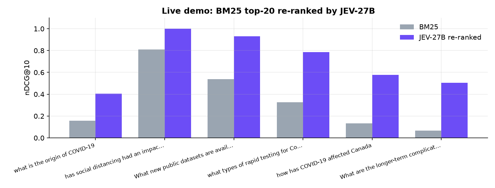

# 01 · Search re-ranking

**Idea.** A search engine's first stage (BM25, a vector index, …) returns a few dozen candidates. JEV-27B System 1 then reads
every *(query, document)* pair and returns a calibrated **P(relevant)** or a **0-5 relevance rating** in one forward pass per pair,
with no text generation. Sort by that number and you have a re-ranker.


| dataset | queries | BM25 | bge-reranker-v2-m3 | **JEV-27B · P(relevant)** | **JEV-27B · rating 0-5** |
|---|---:|---:|---:|---:|---:|
| TREC-COVID (BM25 top-100) | 50 | 0.623 | 0.793 | **0.852** | **0.858** |
| NFCorpus (BM25 top-50) | 323 | 0.321 | 0.341 | **0.375** | 0.374 |
| Amazon ESCI (all judged products) | 300 | — | 0.854 | 0.873 | **0.881** |

nDCG@10, same candidate pools for every system. bge-reranker-v2-m3 is a dedicated 568M cross-encoder trained for re-ranking.
TREC-COVID and NFCorpus are not Decision Index tasks. Amazon ESCI is one of the Decision Index task families, so it is not a
zero-shot result.

## Live demo

`demo.py` re-ranks the BM25 top-20 of six TREC-COVID queries (bundled in `data/`, with the official human relevance labels):



| query | nDCG@10 BM25 | nDCG@10 JEV-27B | time for 40 decisions |
|---|---:|---:|---:|
| what is the origin of COVID-19 | 0.157 | **0.406** | 0.9 s |
| has social distancing had an impact on slowing the spread of COVID-19? | 0.809 | **1.000** | 1.1 s |
| What new public datasets are available related to COVID-19? | 0.537 | **0.931** | 1.1 s |
| what types of rapid testing for Covid-19 have been developed? | 0.325 | **0.785** | 1.1 s |
| how has COVID-19 affected Canada | 0.134 | **0.582** | 1.0 s |
| What are the longer-term complications of those who recover from COVID-19? | 0.066 | **0.506** | 1.0 s |

Full before/after tables: [`sample_output.md`](sample_output.md).

```bash
python demo.py
```

## How it asks

```python
# probability of relevance (kind = choice, yes/no)
decide("choice", {"query": q, "task": "Rank candidate documents/tools by relevance to this query."},
       json.dumps({"candidate": doc, "task": "Assess whether this candidate is relevant/useful to the query. ..."}),
       ["no: Not relevant/useful to the query.", "yes: Relevant/useful to the query."])

# graded relevance (kind = score, expected value of the 0-5 distribution)
expected_score(decide("score", {"query": q, "document": doc},
                      "Rate how relevant the document is to the search query on a 0-5 scale (0 = irrelevant, 5 = perfectly relevant)."))
```

Every request is independent, so a batch of candidates is sent concurrently and vLLM batches them on the GPU
(about 40 decisions per second per query in the demo, on one GPU).

**Data:** TREC-COVID and NFCorpus via [BEIR](https://github.com/beir-cellar/beir) (CORD-19 / NutritionFacts; abstracts truncated
to 1,500 characters), Amazon ESCI ([Apache-2.0](https://github.com/amazon-science/esci-data)).
