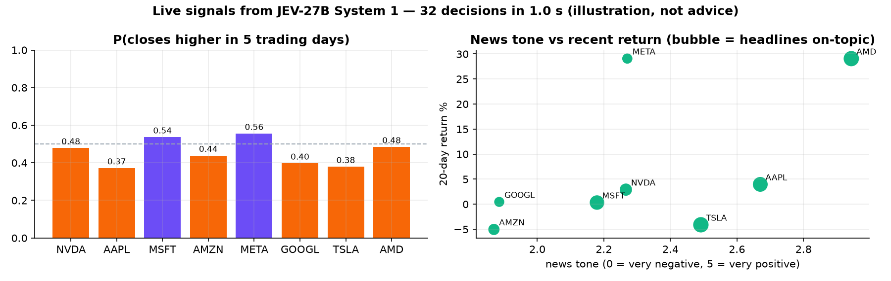

# 02 · Stock signals from prices + headlines

> **Illustration only. Not back-tested, not investment advice.** The model sees only the numbers and headlines in the state;
> it has no special knowledge of the future. Short-term price direction is close to unpredictable, and nothing here shows
> otherwise.

**Idea.** A research or monitoring pipeline needs structured signals from messy inputs: *is this news positive? is it
even about the company? how does the setup look?* JEV-27B System 1 turns a JSON snapshot (Yahoo Finance daily closes + the 5
latest headlines) into four typed decisions per ticker, each a probability distribution, 32 decisions in about one second on one GPU:

| decision | kind | output |
|---|---|---|
| closes higher 5 trading days from now | noul (true/false) | P(up) |
| stance for the next week | choice (strong sell … strong buy) | distribution over 5 stances |
| tone of the news flow | score (0-5) | expected rating |
| are the headlines about the company's own business | noul | P(on-topic): flags noise such as listicles and market wraps |



Run of 29 September 2026 (32 decisions in 1.0 s):

| ticker | close | 5d / 20d / 60d % | vol 20d % | P(up in 5 days) | stance (prob) | news tone 0-5 | headlines on-topic |
|---|---:|---|---:|---:|---|---:|---:|
| NVDA | 227.21 | -0.73 / +2.91 / +16.19 | 27.1 | 0.48 | hold (0.55) | 2.3 | 0.49 |
| AAPL | 329.4 | -3.05 / +3.96 / +5.35 | 23.7 | 0.37 | sell (0.67) | 2.7 | 0.87 |
| MSFT | 508.96 | +2.2 / +0.33 / +31.6 | 24.0 | 0.54 | hold (0.63) | 2.2 | 0.82 |
| AMZN | 246.67 | -3.26 / -5.04 / +1.03 | 21.4 | 0.44 | hold (0.58) | 1.9 | 0.36 |
| META | 738.79 | +0.3 / +29.08 / +23.07 | 54.7 | 0.56 | hold (0.45) | 2.3 | 0.25 |
| GOOGL | 340.92 | -2.92 / +0.46 / -6.97 | 24.9 | 0.40 | hold (0.56) | 1.9 | 0.23 |
| TSLA | 352.84 | -6.88 / -4.11 / -15.94 | 40.6 | 0.38 | hold (0.51) | 2.5 | 0.97 |
| AMD | 607.57 | -2.6 / +29.07 / +10.06 | 56.1 | 0.48 | hold (0.44) | 2.9 | 0.95 |

What to notice: the P(up) values stay close to 0.5 (0.37-0.56); the model does not pretend to know the next week. The
*headlines on-topic* column separates company-specific news (TSLA 0.97, AMD 0.95) from generic market coverage (GOOGL 0.23,
META 0.25), which is the kind of filter a news pipeline needs before any sentiment score is trusted.

```bash
python demo.py                   # default watch-list
python demo.py TSLA NFLX ASML    # your own tickers
```

The state the model sees for one ticker:

```json
{"ticker": "NVDA", "as_of": "2026-09-29", "last_close": 227.21,
 "return_pct": {"1d": -0.72, "5d": -0.73, "20d": 2.91, "60d": 16.19},
 "volatility_20d_annualized_pct": 27.1, "vs_20d_average_pct": 2.05, "vs_50d_average_pct": 4.72,
 "latest_headlines": [{"title": "…", "publisher": "…", "date": "2026-09-29"}, "…"]}
```

For a measured forecasting test against real outcomes, see [05 · football](../05-football-prediction).
