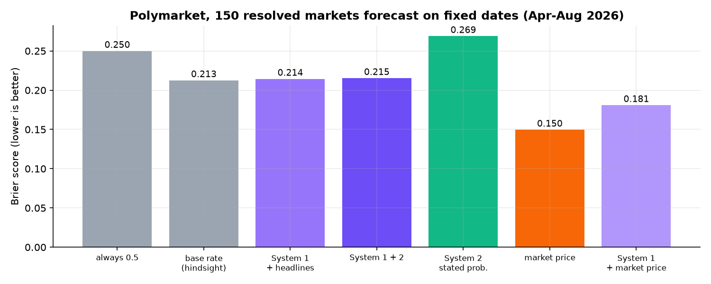

# 03 · Polymarket forecasting

**Question.** Can JEV-27B forecast real-world events (politics, economy, geopolitics, crypto, tech) that resolved after its
training data, and can it improve on the prediction-market price?

`forecast.py` compares, on resolved Polymarket markets:

| forecaster | input |
|---|---|
| JEV System 1 | question + resolution rules |
| JEV System 1 + headlines | + Google News headlines published before the forecast date |
| JEV System 2 (thinking) | same inputs; writes an analysis and states a probability |
| JEV System 1 + 2 | System 1 reads the headlines *and* System 2's analysis |
| JEV System 1 + market price | + the market's price on the forecast date (JEV as a "market corrector") |
| market price | the Yes price on the forecast date |

## Result: JEV does not beat the market

Clean design: **fixed calendar forecast dates** (1 April, 1 May, 1 June, 1 July, 1 August 2026). On each date we took the 30
highest-volume non-sports markets that were open and scheduled to end within 45 days, with the price and headlines as of that
date. That gives 150 markets from 108 events, 31% of which resolved Yes.



| forecaster | Brier ↓ | log loss ↓ | direction ✓ |
|---|---:|---:|---:|
| always 0.5 | 0.250 | 0.693 | 69% |
| base rate of this sample (0.31, hindsight) | 0.213 | 0.616 | 69% |
| JEV System 1, question only | 0.230 | 0.652 | 62% |
| JEV System 1 + headlines | 0.214 | 0.713 | 71% |
| JEV System 2 (thinking), stated probability | 0.269 | 2.070 | 71% |
| JEV System 1 + 2 | 0.215 | 0.782 | 73% |
| **market price on the forecast date** | **0.150** | **0.475** | **80%** |
| control: market price shifted by a constant | 0.153 | 0.480 | 79% |
| JEV System 1 + market price | 0.181 | 0.598 | 77% |
| JEV System 1 + market price + headlines | 0.182 | 0.624 | 77% |

* **On its own**, JEV beats the coin flip (0.250) and matches the hindsight base rate (0.213) using the question and
  headlines only. System 1 + headlines and System 1 + 2 are equally good. System 2's stated probabilities are the worst
  of the JEV variants: over-confident, with log loss 2.07.
* **The market is much better** (0.150). Liquid prediction markets aggregate information a single model does not have.
* **Giving JEV the market price makes it worse** (0.181; event-clustered 95% interval of the change −0.056 to −0.009). JEV
  moves prices towards Yes on average (+0.09 on Yes markets, +0.04 on No markets), and in a sample where most markets
  resolve No that hurts.

Every forecast, headline and System 2 analysis is in [`results_fixed.json`](results_fixed.json).

```bash
python forecast.py fixed           # clean backtest (fixed forecast dates), ~15 min
python forecast.py fixed-summary   # re-print from results_fixed.json
```

## Why the first backtest was withdrawn

Our first backtest (files in [`superseded/`](superseded)) forecast each market **7 days before it actually closed**. That
looked like System 1 + market price improving the market's Brier score from 0.124 to 0.101. On inspection this was an
artefact of the design:

* "Will X happen by date D" markets that resolve **Yes** usually close **early**, as soon as the event happens.
  59% of the Yes markets closed at least 3 days before their scheduled end, versus 33% of the No markets.
* Anchoring the forecast date on the actual close therefore catches Yes markets just before the event, while their price
  still lags. The market *appears* to under-price Yes, and anything that leans Yes looks good.
* A control that simply shifts every market price towards Yes by a constant (fitted leave-one-out) scored **0.088**, better
  than JEV's 0.101. JEV's "gain" was mostly that Yes lean.

So the result is withdrawn. With forecast dates that do not depend on when or how a market resolved (above), the same
control gains nothing (0.153 vs 0.150) and JEV makes the market worse.
