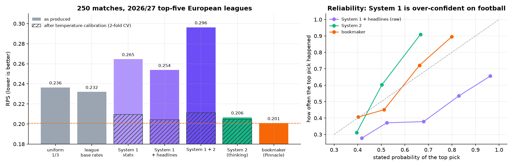

# 04 · Football match prediction vs the bookmakers

**Question.** Given only pre-match information, can JEV-27B forecast *home / draw / away* as well as the betting market?

**Setup.** 250 matches of the 2026/27 season (Premier League, La Liga, Serie A, Bundesliga, Ligue 1, from
[football-data.co.uk](https://www.football-data.co.uk)). The matches were played between 15 August and 20 September 2026. For each
match the model sees last season's table, this season's table and form up to kick-off, last season's head-to-head, and
headlines published before the match date. The reference is **Pinnacle's odds (closing line where available) with the margin removed**,
one of the sharpest public forecasts there is.



| forecaster | RPS ↓ | Brier ↓ | log loss ↓ | top pick correct |
|---|---:|---:|---:|---:|
| uniform 1/3 | 0.2364 | 0.6667 | 1.0986 | 43.2% |
| league base rates (last season) | 0.2319 | 0.6501 | 1.0737 | 43.2% |
| JEV System 1 — stats only | 0.2646 | 0.7403 | 1.4293 | 45.6% |
| JEV System 1 + headlines | 0.2538 | 0.7087 | 1.3670 | 49.6% |
| **JEV System 2 (thinking) — stated probabilities** | **0.2065** | **0.5965** | **1.0015** | 47.2% |
| JEV System 1 + 2 | 0.2963 | 0.7939 | 1.9734 | 48.8% |
| **bookmaker (Pinnacle, margin removed)** | **0.2008** | **0.5826** | **0.9793** | 51.6% |
| JEV System 1 + 2 + bookmaker probabilities | 0.2802 | 0.7541 | 1.8656 | 52.0% |

RPS (ranked probability score) is the standard metric for ordered outcomes like home/draw/away; lower is better.

## What we learned

**1. System 2 (thinking) gets close to the bookmakers.** Reasoning about home advantage, form and how common draws are,
it states probabilities with RPS 0.2065 against the bookmakers' 0.2008, and its confidence is honest: it puts 0.46 on its
top pick on average and is right 47% of the time.

**2. System 1 picks the right direction but is over-confident on football.** It puts 0.75-0.83 on its top pick and is right
only about half the time (right-hand chart). Home/draw/away with frequent draws is unlike the decisions it was calibrated on.
The fix is one number: a **temperature fitted on half the matches and scored on the other half** brings System 1 + headlines
to RPS **0.2042**, level with System 2.

| forecaster | avg. probability of its top pick | top pick correct | RPS after calibration |
|---|---:|---:|---:|
| System 1 — stats only | 0.75 | 0.46 | 0.2094 |
| System 1 + headlines | 0.75 | 0.50 | **0.2042** |
| System 1 + 2 | 0.83 | 0.49 | 0.2113 |
| System 2 | 0.46 | 0.47 | 0.2045 |
| bookmaker | 0.52 | 0.52 | 0.2008 (as is) |

Lesson for any new domain: calibrate System 1 on a few hundred labelled examples before trusting its probabilities.

**3. Nobody beats the closing line here.** Blending 0.7 × bookmaker + 0.3 × System 2 gives RPS 0.2003 versus 0.2008, a
difference far inside the noise for 250 matches.

> The script also prints a flat-stake betting simulation. With 250 matches its profit numbers are luck, not an edge, and
> they are not reported here. Nothing in this folder is betting advice.

```bash
python football.py            # fetch fixtures + headlines, run all forecasters (~10 min), print the scoreboard
python football.py summary    # re-print tables and chart from results.json
```

All results for every match (inputs, System 2 analysis, every probability) are in [`results.json`](results.json);
the printed tables are in [`sample_output.md`](sample_output.md).
