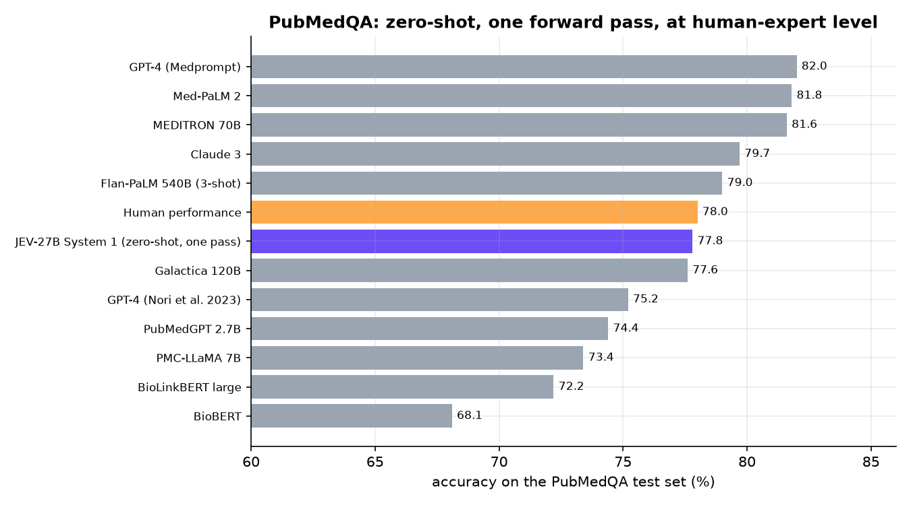

# 08 · Biomedical research questions: human-expert level in one forward pass

> **Zero-shot.** JEV-27B has never been trained on PubMedQA, and the prompt contains no examples. Each question is one
> forward pass that returns a probability for *yes*, *no* and *maybe*.

**Idea.** Drug discovery and clinical research run on reading papers. [PubMedQA](https://pubmedqa.github.io) turns that into a
benchmark: a research question about a PubMed abstract, answered *yes / no / maybe*, with expert labels. In the standard
reasoning-required setting the model sees the question and the abstract without its conclusion.



## 77.8% on the official test set: level with human experts

| model | accuracy (%) |
|---|---:|
| GPT-4 (Medprompt) | 82.0 |
| Med-PaLM 2 | 81.8 |
| MEDITRON 70B | 81.6 |
| Claude 3 | 79.7 |
| Flan-PaLM 540B (3-shot) | 79.0 |
| Human performance | 78.0 |
| **JEV-27B System 1, zero-shot, one forward pass** | **77.8** |
| Galactica 120B | 77.6 |
| GPT-4 (Nori et al. 2023) | 75.2 |
| PubMedGPT 2.7B | 74.4 |
| PMC-LLaMA 7B | 73.4 |
| BioLinkBERT large | 72.2 |
| BioBERT | 68.1 |

Official test set of 500 expert-labelled questions. Other rows are from the
[PubMedQA leaderboard](https://pubmedqa.github.io) (reasoning-required setting).

* **At human-expert level** (77.8% vs 78.0%), and above GPT-4's published zero-shot result (75.2%), Galactica 120B and
  every biomedical model up to PubMedGPT and BioBERT.
* **Macro-F1 63.1%**, above the published 55.8% of GPT-3.5 + Z-Code++ and 52.7% of BioBERT.
* **Fast:** all 500 questions in 27 seconds on one GPU, with a calibrated probability for each answer.

## Example

*"Does immediate breast reconstruction compromise the delivery of adjuvant chemotherapy?"* JEV-27B reads the abstract and
answers **no** with probability 1.00. The expert answer is also *no*.

```python
decide("choice", {"research_question": question, "abstract": abstract},
       "Based on this abstract, what is the answer to the research question?", ["yes", "no", "maybe"])
# -> {'yes': 0.00, 'no': 1.00, 'maybe': 0.00}
```

```bash
python demo.py            # downloads PubMedQA, answers the 500 test questions, tables + chart
python demo.py summary    # from results.json
```

The web app has a **Biomedical QA** tab: pick a question, read the abstract, and see JEV's answer next to the expert's.

**Data:** PubMedQA (MIT licence), downloaded at run time.
