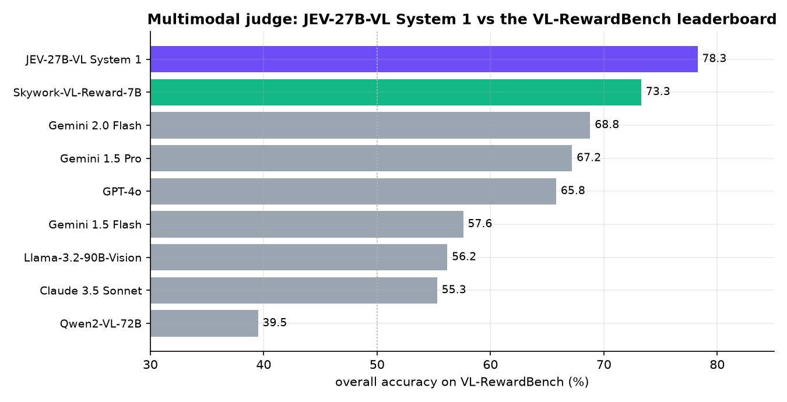

# 09 · Multimodal judge: #1 on the VL-RewardBench leaderboard

> **Zero-shot over images, one forward pass.** JEV-27B-VL's decision head was trained on text only. Here it looks at an image,
> a user's question and two answers, and says which answer is better.

**Idea.** Training and evaluating vision-language models needs a judge: which of two answers about an image is more accurate,
and which one describes things that are not there? [VL-RewardBench](https://vl-rewardbench.github.io) (CVPR 2025) is a hard
benchmark for exactly this, with 1,247 human-verified pairs across general questions from real users, visual hallucination
detection, and multimodal knowledge and math reasoning. Its authors note that even GPT-4o gets only about two thirds right.

System 1 returns **P(answer A is better)** in one forward pass. It asks once per order (A/B and B/A) and averages.



## Results

| judge | general | hallucination | reasoning | **overall** | macro average |
|---|---:|---:|---:|---:|---:|
| **JEV-27B-VL System 1** | 58.0 | **83.2** | **78.2** | **78.3** | **73.1** |
| Skywork-VL-Reward-7B (trained reward model) | **65.6** | 80.2 | 61.3 | 73.3 | 69.0 |
| Gemini 2.0 Flash | 50.8 | 72.6 | 70.1 | 68.8 | 64.5 |
| Gemini 1.5 Pro | 50.8 | 72.5 | 64.2 | 67.2 | 62.5 |
| GPT-4o | 49.1 | 67.6 | 70.5 | 65.8 | 62.4 |
| Gemini 1.5 Flash | 47.8 | 59.6 | 58.4 | 57.6 | 55.3 |
| Llama-3.2-90B-Vision | 42.6 | 57.3 | 61.7 | 56.2 | 53.9 |
| Claude 3.5 Sonnet | 43.4 | 55.0 | 62.3 | 55.3 | 53.6 |
| Qwen2-VL-72B | 38.1 | 32.8 | 58.0 | 39.5 | 43.0 |

Accuracy in %. Comparison rows come from the official leaderboard (26 models, updated 11 May 2025, linked from the
[VL-RewardBench space](https://huggingface.co/spaces/MMInstruction/VL-RewardBench)); the table shows the top models and
some familiar names.

* **Highest overall accuracy on the leaderboard: 78.3%** (95% interval 75.9 to 80.5), 5 points above the best entry, the
  purpose-trained Skywork-VL-Reward-7B (73.3), and 12.5 points above GPT-4o (65.8).
* **Best at catching visual hallucinations (83.2%)** and at judging multimodal reasoning (78.2%).
* **Fast:** 2,494 decisions in 163 seconds on one GPU. Swapping the order of the two answers leaves the verdict unchanged
  89% of the time.

## How it asks

```python
from jev_client import decide_mm
parts = ["User's question about the image: " + question + "\nImage: ", {"image": "photo.jpg"},
         "\n\n[Response A]\n" + answer_a + "\n\n[Response B]\n" + answer_b]
decide_mm("choice", parts, "Which response answers the user's question about the image better: more accurate to what is "
          "actually in the image, correct, helpful, and free of hallucinated details?", ["Response A", "Response B"])
```

```bash
bash common/serve_jev27b_mm.sh     # autotrust/JEV-27B-VL
python demo.py                     # downloads VL-RewardBench (~100 MB), judges all 1,247 pairs, tables + chart
python demo.py summary             # from results.json
```

**Data:** VL-RewardBench (research use), downloaded at run time; this folder stores only item IDs and scores.
