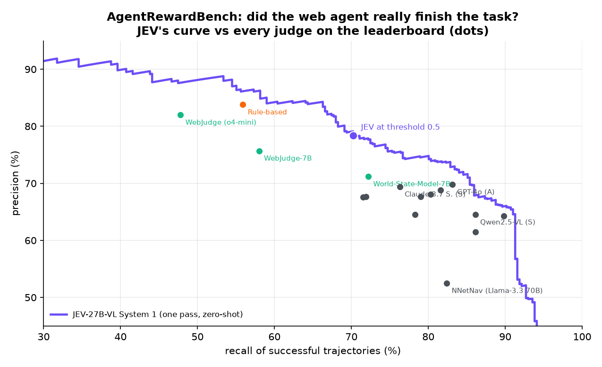

# 10 · Agent judge: did the AI agent really finish the task?

> **Zero-shot, one forward pass per trajectory.** JEV-27B-VL reads the user's goal, the agent's actions and final message,
> looks at the final screenshot, and returns **P(task completed)**.

**Why it matters.** AI agents that browse the web and operate software are everywhere, and every team building them needs to
know whether a run actually succeeded, to report results, filter training data or reward reinforcement learning. Agents
often claim success when they did not finish. [AgentRewardBench](https://agent-reward-bench.github.io) (McGill, 2025)
measures how well automatic judges agree with expert annotators on 1,302 real trajectories from GPT-4o, Claude 3.7 Sonnet,
Llama 3.3 and Qwen2.5-VL agents across WebArena, VisualWebArena, WorkArena and AssistantBench.



## Higher precision than every judge on the leaderboard, at its own recall

The leaderboard ranks judges by precision (of the trajectories a judge calls successful, how many really were), and each
judge sits at a different recall. JEV outputs a probability, so it can be compared at each judge's own recall:

| judge | its precision | its recall | **JEV precision at the same recall** | difference |
|---|---:|---:|---:|---:|
| Rule-based | 83.8 | 55.9 | **86.2** | +2.4 |
| WebJudge (o4-mini) | 82.0 | 47.8 | **87.7** | +5.7 |
| WebJudge-7B (trained judge) | 75.7 | 58.0 | **86.2** | +10.5 |
| World-State-Model-7B (trained judge) | 71.2 | 72.2 | **77.7** | +6.5 |
| GPT-4o (accessibility tree) | 69.8 | 83.1 | **72.9** | +3.1 |
| Claude 3.7 Sonnet (screenshot) | 69.4 | 76.3 | **75.6** | +6.2 |
| Claude 3.7 Sonnet (accessibility tree) | 68.8 | 81.6 | **73.9** | +5.1 |
| GPT-4o (screenshot) | 68.1 | 80.3 | **74.3** | +6.2 |
| Llama 3.3 70B (accessibility tree) | 67.7 | 79.0 | **74.6** | +6.9 |
| Qwen2.5-VL-72B (screenshot) | 64.5 | 86.1 | **67.9** | +3.4 |
| GPT-4o mini (screenshot) | 64.5 | 78.3 | **74.6** | +10.1 |

All 16 leaderboard entries are shown in [`sample_output.md`](sample_output.md); JEV is ahead of every one, by 1.7 to 21.2 points.

* **At its default threshold (0.5):** precision **78.4**, recall 70.2, and an AUROC of **0.91** for telling successful runs
  from failed ones.
* **One pass per trajectory:** all 1,302 judgements took about 4 minutes on one GPU, with no reasoning text to generate or
  parse.
* **A dial, not a fixed verdict:** raise the threshold for a precise success filter (86-88% precision at ~50% recall), or
  lower it to catch almost every success.

## How it asks

```python
parts = ["Evaluating a web-browsing AI agent.\n" + goal_actions_and_final_message,
         "\n\nFinal screenshot of the web page: ", {"image": "final_screenshot.png"}]
decide_mm("noul", parts, "Is this scenario one where: the agent successfully completed the user's task "
          "(the goal was fully achieved, or the requested information was correctly given to the user)?")
```

```bash
bash common/serve_jev27b_mm.sh     # autotrust/JEV-27B-VL
python demo.py                     # downloads the needed files (~0.5 GB), judges 1,302 trajectories, tables + chart
python demo.py summary             # from results.json
```

**Data:** AgentRewardBench (McGill-NLP), downloaded at run time; this folder stores only trajectory IDs, expert labels and
JEV's scores. Leaderboard numbers are read from the official leaderboard space.
