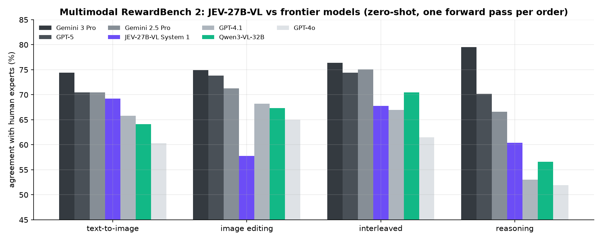
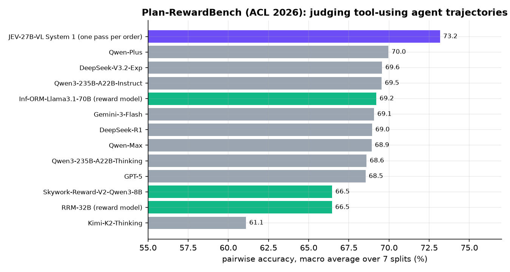
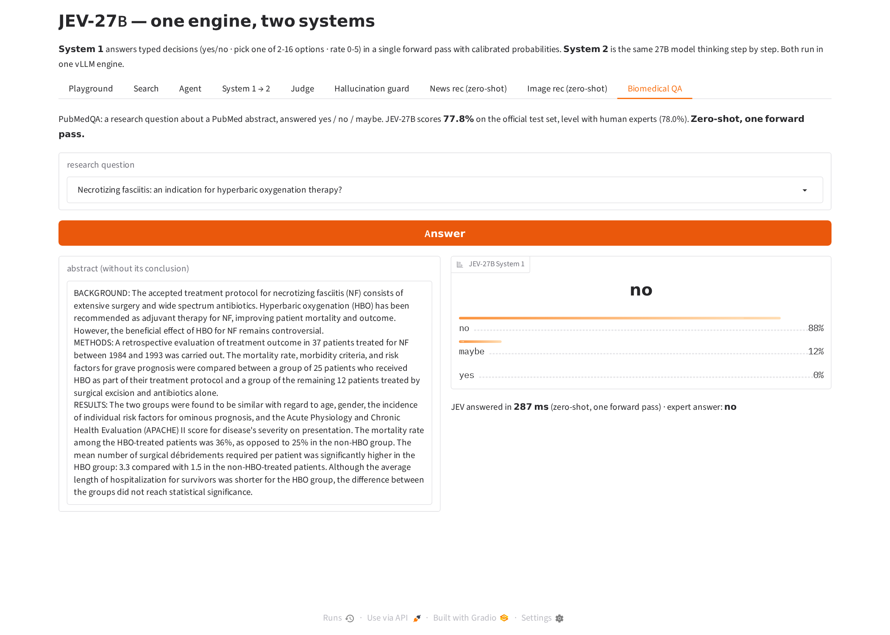

# JEV-27B 演示亮点

[autotrust/JEV-27B](https://huggingface.co/autotrust/JEV-27B) 在同一个 vLLM 引擎、同一套权重里提供两种回答方式：

| | 做什么 | 输出 | 典型耗时 |
|---|---|---|---|
| **System 1** | 结构化决策：是/否 · 从 2-16 个选项中选一个 · 0-5 打分 | 每个选项的概率，一次前向计算 | 约 0.1 秒 |
| **System 2** | 原版 Qwen3.8-27B，可以一步步推理 | 文字 / 推理过程 | 几秒到几十秒 |

以下是十个演示和网页应用的亮点。

---

## 01 · 搜索重排

**用法：** 搜索引擎先召回一批候选文档（例如 BM25），JEV-27B 逐条阅读"查询 + 文档"，一步给出"相关的概率"或 0–5 分，按这个数重新排序。

**亮点一：超过专门的重排模型。** JEV-27B 没有针对排序做过专门微调，只是当成通用的"相关性裁判"来用，却超过了专门训练的重排模型 bge-reranker-v2-m3。

| 数据集 | JEV-27B | bge-reranker-v2-m3 | BM25（原始排序） |
|---|---:|---:|---:|
| TREC-COVID（新冠文献检索） | **0.858** | 0.793 | 0.623 |
| NFCorpus（医学营养检索） | **0.375** | 0.341 | 0.321 |
| Amazon ESCI（电商商品搜索） | **0.881** | 0.854 | — |

指标都是 nDCG@10，所有系统使用相同的候选集。前两个数据集不属于 Decision Index 的任务，可以看作泛化能力的测试。


**亮点二：现场效果明显。** 6 个新冠查询，每个查询 40 个判断大约 1 秒完成。

| 查询 | BM25 排序 | JEV 重排 |
|---|---:|---:|
| 康复者的长期并发症 | 0.066 | **0.506** |
| 新冠对加拿大的影响 | 0.134 | **0.582** |
| 快速检测有哪些类型 | 0.325 | **0.785** |
| 有哪些新的公开数据集 | 0.537 | **0.931** |

详见 [01-search-ranking](01-search-ranking)。

---

## 02 · Agent 日常决策

**用法：** 智能体和后台流程每天要做大量小决策，比如分给哪个团队、多紧急、是不是诈骗、能不能发布、先调用哪个工具。JEV 一次前向计算就给出每个选项的概率。

**亮点一：不需要解析输出。** 不生成文字，没有格式出错的风险，直接拿到概率。24 个决策一起发，**0.43 秒**完成。

**亮点二：判断准确。**

- **钓鱼识别：** 仿冒域名 `paypa1` 判为 **1.00**，"CEO 紧急转账"骗局判为 **0.95**；真实的 GitHub 安全提醒只有 0.17，Notion 收据只有 0.10。
- **内容审核：** 骂人加威胁的帖子删除（1.00），垃圾广告删除（1.00）；言辞激烈但正当的批评保留（0.81）。
- **工单分流：** "全员 SSO 登录失败、11 点有董事会演示"分到平台组、判为紧急（0.91）；"加个深色模式"分到产品反馈、低优先级（0.99）。
- **工具选择：** 查订单 → 订单数据库（0.99）；需求含糊 → 先问用户（1.00）。


**亮点三：概率本身就是信号。** "下周二下午约个会"没有给出具体时间，模型在"先问用户"（0.57）和"直接建日程"（0.41）之间犹豫。智能体看到这种不确定，就知道该先向用户确认，而不是瞎猜。同样的道理，可以用概率设定"低于多少就转人工"的门槛。

详见 [02-agent-decisions](02-agent-decisions)。

---

## 03 · System 1 → System 2：只在需要时才思考

**用法：** 同一个引擎、同一套权重有两种模式：System 1 快速作答（约 0.1 秒），System 2 一步步推理（几秒到几十秒）。System 1 有把握就直接回答，没把握才交给 System 2。

**亮点一：大部分问题瞬间回答，准确率接近全程思考。** 在 120 道有标准答案的题上（小学数学、代数应用题、科学、常识），以置信度 0.70 为门槛：

| 策略 | 交给 System 2 的比例 | 准确率 | 等待时间中位数 |
|---|---:|---:|---:|
| 只用 System 1 | 0% | 0.792 | 0.11 秒 |
| **置信度低于 0.70 才交给 System 2** | **30%** | **0.892** | **0.11 秒** |
| 每题都用 System 2 | 100% | 0.917 | 3.75 秒 |

70% 的题 0.11 秒就答完；与"每题都思考"的准确率差距补回了 80%。


**亮点二：System 1 的置信度可信。** 它说"≥ 0.90 有把握"时，正确率 97%；置信度低于 0.70 时，正确率只有 50% 左右。它知道自己什么时候不会，所以可以放心用它来决定要不要思考。

**亮点三：数学题提升最大。** 代数应用题 0.60 → 0.87，小学数学 0.80 → 0.90。

**亮点四：例子直观。**

- 经典陷阱"球拍和球一共 1.10 美元，球拍比球贵 1 美元，球多少钱"：System 1 在 **149 毫秒**内答对（0.05 美元）。
- "今天星期二，100 天后星期几"：System 1 只有 0.32 的把握，自动转给 System 2，思考 **3.4 秒**后答对（星期四）。

**亮点五：不需要额外模型。** 不用另训路由器，也不用第二个模型或额外 GPU，一个引擎全部搞定。

详见 [03-system1-to-system2](03-system1-to-system2)。

---

## 04 · 回答质量裁判：一步判断哪个回答更好

**用法：** 评估 AI 回答（比较模型、给 RLHF 当奖励模型、监控线上质量）通常要让大模型写一段评语，再从中解析结论。JEV-27B System 1 读入"用户请求 + 回答 A + 回答 B"，一步给出"A 更好的概率"。A/B 两种顺序各判断一次后取平均，消除位置偏差。

**亮点一：RewardBench 89.9 分，超过 GPT-4o、Gemini 1.5 Pro、Claude 3.5 Sonnet 当裁判的成绩。** 在完整的 2,985 对人工核验的"好回答 vs 差回答"上，按官方方式计分：

| 裁判 | 总分 | 日常对话 | 困难对话 | 安全 | 推理 |
|---|---:|---:|---:|---:|---:|
| **JEV-27B System 1（一步判断）** | **89.9** | 94.4 | 81.2 | 93.1 | 90.9 |
| Gemini 1.5 Pro（0514） | 88.2 | 92.3 | 80.6 | 87.9 | 92.0 |
| GPT-4o（2024-08-06） | 86.7 | 96.1 | 76.1 | 88.1 | 86.6 |
| Claude 3.5 Sonnet（2024-06-20） | 84.2 | 96.4 | 74.0 | 81.6 | 84.7 |
| Llama 3.1 405B Instruct | 84.1 | 97.2 | 74.6 | 77.6 | 87.1 |

对比分数来自 RewardBench 公开排行榜。5,970 次判断在单张 GPU 上用了 185 秒，每秒 32 次。


**亮点二：和思考后判断一样准，快约 6 倍。** 400 对抽样上：

| 方式 | 准确率 | 每次判断耗时（中位数） |
|---|---:|---:|
| System 1 一步判断 | 0.900 | 1.3 秒（两种顺序合计） |
| System 2 思考后判断 | 0.902 | 7.5 秒 |
| **门控：System 1 没把握（< 0.8）才让 System 2 思考** | **0.915**（19% 需要思考） | |

**亮点三：几乎没有位置偏差。** 交换 A、B 顺序后，96% 的判断结论不变。

详见 [04-response-judge](04-response-judge)。

---

## 05 · 防幻觉：不确定就不答

**用法：** System 2 回答问题，System 1 读入"问题 + 答案"，一步给出"这个答案正确的概率"。概率低就回复"我不确定"（或者转去搜索、转人工、深入思考），而不是编一个答案。

**亮点一：只回答有把握的一半，准确率从 71% 提到 96%。** 在 1,000 道 TriviaQA 常识题上，System 2 直接作答的正确率是 71.2%：

| 回答的比例 | 用 System 1 判断筛选 | 用 System 2 自报信心筛选 |
|---:|---:|---:|
| 30% | **97.7%** | 85.3% |
| 50% | **96.4%** | 87.2% |
| 70% | **90.3%** | 86.0% |
| 全部回答 | 71.2% | 71.2% |


**亮点二：比"问模型自己有多大把握"准得多。** 区分答对 / 答错的能力（AUROC）：System 1 **0.900**，System 2 自报信心 0.773。System 2 自报的信心只有 7 种取值，86% 都 ≥ 0.9（69% 直接说 1.0）。

**亮点三：能识破"自信的错误"。** System 2 自称至少 90% 有把握、实际却答错的有 184 个，System 1 把其中 54 个打到了 0.6 以下。例如：

| 问题 | System 2 的回答 | System 2 自报信心 | System 1 判断 | 正确答案 |
|---|---|---:|---:|---|
| 'The mirror crack'd from side to side' 出自哪首诗？ | The Jabberwocky | 0.95 | **0.37** | The Lady of Shalott |
| 哪种乐器可以有 21、22 或 23 根弦？ | 竖琴 | 0.95 | **0.41** | 西塔琴 |
| Florentine Girdle 是一种什么？ | 钻石 | 1.00 | **0.41** | 贞操带 |

**亮点四：System 1 给出的数字可信。** 它说 ≥ 0.97 的 223 个答案，99.1% 正确；说 0.90–0.97 的 256 个，94.1% 正确。每次检查只多花约 0.24 秒。

详见 [05-hallucination-guard](05-hallucination-guard)。

---

## 06 · 零样本新闻推荐

> **零样本：** JEV-27B 从来没有用 MIND 数据、新闻推荐数据或任何点击数据训练过。它没有用户向量，也不看文章的点击数，不需要任何训练，只读文字。

**用法：** System 1 读入用户最近点过的新闻标题和一篇候选文章，一步给出"这个用户会点它的概率"，按这个概率排序就是推荐结果。新用户只要点过几条就能用；刚发布、还没有任何点击记录的新文章，从第一秒起就能被推荐。

**数据：** 微软新闻数据集 MIND（真实 MSN 新闻用户）。在 2019 年 11 月 15 日的 500 次曝光上评测（9,346 篇候选文章，6.8% 被点击），用 MIND 标准指标。


**亮点一：零样本对零样本，JEV 明显领先。**

| 方法（都没用 MIND 训练） | AUC | nDCG@10 |
|---|---:|---:|
| 随机排序 | 0.515 | 0.367 |
| 实时热度（曝光之前的点击数） | 0.546 | 0.404 |
| 标题文本相似度 | 0.546 | 0.407 |
| 类别匹配 | 0.606 | 0.447 |
| **JEV-27B System 1（零样本）** | **0.642** | **0.486** |

比最好的零样本基准高 0.036（95% 置信区间 +0.008 到 +0.064）。JEV 读懂了用户关心什么、文章讲什么，而不是简单地匹配词语或类别。

**亮点二：零样本就超过了用 MIND 训练过的排序模型。**

| 方法 | 是否用 MIND 训练 | AUC |
|---|---|---:|
| LightGBM 排序模型 | 是，1,000 次曝光 | 0.590 |
| LightGBM 排序模型 | 是，4,000 次曝光 | 0.616 |
| **JEV-27B System 1** | **否，零样本** | **0.642** |

**亮点三：加进已有模型，等于多了 4 倍训练数据。** 用同样的 1,000 次曝光训练，只多加一个"JEV 零样本打分"特征，AUC 从 0.590 升到 0.617，和用 4 倍数据训练的模型（0.616）一样。

**亮点四：现场演示直观。** 网页应用里选一个真实用户，比如一位常看游戏新闻的用户：JEV 把他实际点击的两篇游戏文章排在 26 篇候选里的第 1、第 2 名，打分只用 1.5 秒。

详见 [06-news-recommendation](06-news-recommendation)。

---

## 07 · 零样本短视频推荐：JEV 看封面，可用于 TikTok 式信息流

> **零样本 + 多模态：** JEV-27B 从来没有用 MicroLens、推荐数据或任何点击数据训练过，它的决策头也只用文本训练过。这里它看的是图片：用户看过的视频封面，以及候选视频的封面。

**用法：** 短视频信息流（比如 TikTok、快手）要为每个用户、每条新视频决定推不推。System 1 看用户最近看过的 5 个视频封面和 1 个候选封面，一步给出"这个用户会看它的概率"。不需要交互记录、物品向量或任何训练；一个新视频只凭封面就能被推荐，不必等有人看过，解决了冷启动问题。

**数据：** MicroLens-100k（西湖大学发布的短视频推荐数据集，带原始封面图）。随机 200 个用户，把每人最后看的那个视频，藏进同一时期（前后 3 天）其他用户在看的 19 个视频里，模拟当时信息流里展示的内容，各方法对这 20 个候选排序。


**亮点一：看图远胜读标题。** 只看封面 AUC **0.727**，只看标题 0.649，提升 0.078（95% 置信区间 +0.031 到 +0.126）。

**亮点二：零样本就追平协同过滤。** 物品协同过滤用了 59,045 个其他用户的观看记录，JEV 只看封面、不用任何交互数据，AUC 和它一样（0.727 对 0.728），前 5 命中率还更高（0.59 对 0.49）。

| 方法 | 是否用交互数据 | AUC | 前 5 命中率 |
|---|---|---:|---:|
| 随机 | 否 | 0.489 | 0.205 |
| 热度 | 只用统计 | 0.505 | 0.230 |
| 标题文本相似度 | 否 | 0.602 | 0.385 |
| JEV 只看标题 | **否，零样本** | 0.649 | 0.455 |
| **JEV 只看封面** | **否，零样本** | **0.727** | **0.590** |
| 物品协同过滤（参考） | 是，59,045 个用户 | 0.728 | 0.490 |

**亮点三：新视频也能推荐。** 协同过滤需要"有人一起看过"的记录，JEV 只需要一张封面。

**亮点四：现场演示直观。** 网页应用里选一个用户，例如一位最近在看动漫配音、看过某部作品第 1.6 集的用户：JEV 只看封面，就把同系列第 1.9 集排在 20 个候选的第 1 名（点击概率 1.00），这正是他接下来真正看的视频；20 张封面打分只用 2.6 秒。

**运行方式：** 使用新发布的 [**autotrust/JEV-27B-VL**](https://huggingface.co/autotrust/JEV-27B-VL)（能看图的 JEV-27B）：多模态的 Qwen3.8-27B 底座（语言权重与 JEV-27B 完全相同）加上 JEV 的适配器和决策头。`common/serve_jev27b_mm.sh` 会自动下载并启动它，两个系统就都能看图；这个服务也能运行其他所有演示。

详见 [07-video-recommendation](07-video-recommendation)。

---

## 08 · 生物医学研究问答：一步判断，达到人类专家水平

> **零样本：** JEV-27B 从来没有用 PubMedQA 训练过，提示词里也没有任何示例。每道题只做一次前向计算，给出"是 / 否 / 不确定"三个选项的概率。

**用法：** 药物研发和临床研究离不开读文献。PubMedQA 把这件事变成了 benchmark：针对一篇 PubMed 论文摘要提出一个研究问题，回答"是 / 否 / 不确定"，答案由专家标注。标准的"需要推理"设定下，模型只看问题和去掉结论段的摘要。


**亮点一：官方测试集准确率 77.8%，和人类专家（78.0%）持平。**

| 模型 | 准确率 |
|---|---:|
| GPT-4（Medprompt） | 82.0% |
| Med-PaLM 2 | 81.8% |
| Claude 3 | 79.7% |
| 人类专家 | 78.0% |
| **JEV-27B System 1（零样本，一次前向计算）** | **77.8%** |
| Galactica 120B | 77.6% |
| GPT-4（Nori 等人 2023 年的零样本结果） | 75.2% |
| BioBERT | 68.1% |

**亮点二：超过当初零样本的 GPT-4**（75.2%），以及 Galactica 120B、PubMedGPT、BioBERT 等一众生物医学专用模型。macro-F1 63.1%，高于排行榜上的 GPT-3.5 + Z-Code++（55.8%）和 BioBERT（52.7%）。

**亮点三：快。** 500 道题 27 秒全部答完，每个答案都带校准过的概率。

**亮点四：现场演示直观。** 网页应用里选一道题，就能看到摘要、JEV 的答案概率和专家答案。例如"坏死性筋膜炎是高压氧治疗的适应症吗？"，JEV 用 287 毫秒答"否"（88%），专家答案也是"否"。

详见 [08-biomedical-qa](08-biomedical-qa)。

---

## 09 · 多模态裁判：看图判断哪个回答更好

> **看图判断是零样本，一次前向计算。** JEV-27B-VL 的决策头只用文本训练过。这里它看一张图、一个问题和两个回答，判断哪个回答更好。

**用法：** 训练和评估视觉语言大模型都需要一个裁判：对同一张图的两个回答，哪个更准确，哪个"看到了不存在的东西"？VL-RewardBench（CVPR 2025）正是这方面的高难度 benchmark：1,247 对人工核验的回答，涵盖真实用户的日常提问、视觉幻觉检测、多模态知识与数学推理。作者指出，连 GPT-4o 也只能答对约三分之二。


| 裁判 | 日常问答 | 视觉幻觉 | 推理 | **总体** |
|---|---:|---:|---:|---:|
| **JEV-27B-VL System 1** | 58.0 | **83.2** | **78.2** | **78.3** |
| Skywork-VL-Reward-7B（专门训练的奖励模型） | 65.6 | 80.2 | 61.3 | 73.3 |
| Gemini 2.0 Flash | 50.8 | 72.6 | 70.1 | 68.8 |
| Gemini 1.5 Pro | 50.8 | 72.5 | 64.2 | 67.2 |
| GPT-4o | 49.1 | 67.6 | 70.5 | 65.8 |
| Claude 3.5 Sonnet | 43.4 | 55.0 | 62.3 | 55.3 |

**亮点一：在 VL-RewardBench 上超过排行榜上的所有模型，78.3%。** 比榜首、专门训练的 Skywork-VL-Reward-7B（73.3%）高 5 个百分点，比 GPT-4o（65.8%）高 12.5 个百分点。对比分数来自官方排行榜（26 个模型，2025 年 5 月更新）。

**亮点二：最会识别视觉幻觉（83.2%）**，判断多模态推理也最准（78.2%）。

**亮点三：快。** 2,494 次判断只用 163 秒；交换两个回答的顺序，89% 的结论不变。

**在更新的 benchmark 上：** VL-RewardBench 的排行榜只到 2024–2025 年的模型。Meta 在 2025 年 12 月发布（2026 年 1 月修订）的 Multimodal RewardBench 2（MMRB2）收录了 GPT-5、Gemini 3 Pro 等最新一代模型，每类 1,000 对专家标注：



| 裁判 | 文生图 | 图片编辑 | 图文交错 | 推理 | 平均 |
|---|---:|---:|---:|---:|---:|
| Gemini 3 Pro | 74.4 | 74.9 | 76.4 | 79.5 | 76.3 |
| GPT-5 | 70.5 | 73.8 | 74.4 | 70.2 | 72.2 |
| Gemini 2.5 Pro | 70.5 | 71.3 | 75.1 | 66.6 | 70.9 |
| Qwen3-VL-32B | 64.1 | 67.3 | 70.5 | 56.6 | 64.6 |
| **JEV-27B-VL** | **69.2** | 57.8 | **67.8** | **60.4** | **63.8** |
| GPT-4.1 | 65.8 | 68.2 | 67.0 | 53.0 | 63.5 |
| GPT-4o | 60.3 | 65.0 | 61.5 | 51.9 | 59.7 |

- **文生图 69.2%：** 和 GPT-5、Gemini 2.5 Pro（70.5%）只差 1.3 个百分点，超过 GPT-4.1、GPT-4o、所有开源模型，以及专门训练的图片奖励模型。
- **推理 60.4%：** 超过论文里所有开源模型，也超过 GPT-4.1 和 GPT-4o。
- **四类平均 63.8%：** 和 GPT-4.1、Qwen3-VL-32B 同一档；GPT-5 和 Gemini 3 Pro 仍然领先，图片编辑是 JEV 最弱的一类。

详见 [09-multimodal-judge](09-multimodal-judge)。

---

## 10 · 智能体裁判：哪次运行更好，任务真的完成了吗？

> **零样本，每条轨迹只做一次前向计算。** JEV-27B-VL 读用户的目标、智能体的操作记录和最终回复，再看最后一张网页截图，给出"任务已完成"的概率。

**为什么重要：** 能上网、能操作软件的 AI 智能体正在普及。开发它们的团队都要知道每次运行到底成没成功，用来统计效果、筛选训练数据、给强化学习打分。而智能体经常"自称完成"，实际并没有做完。AgentRewardBench（McGill 大学，2025）用 1,302 条真实轨迹（GPT-4o、Claude 3.7 Sonnet、Llama 3.3、Qwen2.5-VL 智能体在 WebArena、VisualWebArena、WorkArena、AssistantBench 上执行的任务），衡量各种自动裁判和专家标注的一致程度。

**2026 年的新 benchmark：Plan-RewardBench（ACL 2026 主会）。** 比较工具调用智能体的两条完整轨迹哪条更好，共 1,171 对，覆盖多步规划、工具出错后的恢复、安全拒绝、识别工具无关等场景。对比数字来自论文表 4：



| 裁判 | 平均准确率 |
|---|---:|
| **JEV-27B-VL System 1** | **73.2** |
| Qwen-Plus | 70.0 |
| DeepSeek-V3.2 | 69.6 |
| Inf-ORM-Llama3.1-70B（专门训练的奖励模型） | 69.2 |
| Gemini-3-Flash | 69.1 |
| GPT-5 | 68.5 |
| Kimi-K2-Thinking | 61.1 |

JEV 排第一，比论文里最好的裁判高 3.2 个百分点（95% 置信区间 70.2–76.1），比 GPT-5 高 4.6 个百分点；在最难的多轮规划和出错恢复两个子集上也是最好。2,342 次判断约 6 分钟。

**AgentRewardBench（带截图的网页智能体，2025）：**


**亮点一：在每个裁判自己的召回率下，精确率全部超过排行榜上的裁判。**

| 裁判 | 它的精确率 | 它的召回率 | **JEV 同召回率下的精确率** | 领先 |
|---|---:|---:|---:|---:|
| 规则方法（原榜首） | 83.8 | 55.9 | **86.2** | +2.4 |
| WebJudge（o4-mini） | 82.0 | 47.8 | **87.7** | +5.7 |
| WebJudge-7B（专门训练的裁判） | 75.7 | 58.0 | **86.2** | +10.5 |
| World-State-Model-7B（专门训练的裁判） | 71.2 | 72.2 | **77.7** | +6.5 |
| GPT-4o | 69.8 | 83.1 | **72.9** | +3.1 |
| Claude 3.7 Sonnet（看截图） | 69.4 | 76.3 | **75.6** | +6.2 |
| Qwen2.5-VL-72B（看截图） | 64.5 | 86.1 | **67.9** | +3.4 |

排行榜上全部 16 个裁判都被超过，领先 1.7 到 21.2 个百分点。

**亮点二：一步判断，又快又准。** 默认阈值 0.5 时精确率 78.4、召回率 70.2；区分成功和失败的 AUROC 达到 0.91。1,302 条轨迹约 4 分钟判断完，不需要生成和解析推理文字。

**亮点三：概率就是可调的旋钮。** 要一个很严格的"成功过滤器"，就调高阈值（召回率约 50% 时精确率 86–88%）；想尽量不漏掉成功的运行，就调低阈值。

详见 [10-agent-judge](10-agent-judge)。

---

## 网页应用

`python app/app.py` 启动后打开 http://localhost:7860 ，九个页面都可以现场操作：

| 页面 | 可以做什么 |
|---|---|
| **System 1 试玩** | 随便输入问题和选项，约 0.1 秒出概率 |
| **搜索重排** | 选一个查询，一键重排，并显示 nDCG 前后对比 |
| **Agent 决策** | 工单分流、钓鱼检测、工具选择，都可以自己改输入再试 |
| **System 1 → System 2** | 直接看到"System 1 没把握 → 自动转给 System 2 → 思考后作答"的完整过程 |
| **回答质量裁判** | 输入一个问题和两个回答，System 1 判断哪个更好；没把握时自动让 System 2 思考 |
| **防幻觉** | 提一个问题，System 2 作答、System 1 检查；不够可信就显示"我不确定" |
| **零样本新闻推荐** | 选一个真实用户，看他最近读过的新闻，JEV 现场给候选文章排序，并标出他实际点了哪篇 |
| **零样本短视频推荐** | 选一个用户，看他最近看过的视频封面，JEV 只看封面给 20 个候选排序，并标出他接下来实际看的是哪个 |
| **生物医学问答** | 选一道 PubMedQA 研究问题，看摘要、JEV 的答案概率和专家答案 |

| | |
|---|---|
|  |  |
|  |  |
|  |  |
|  |  |
|  | |

---

## 切换 API 服务

所有演示和网页应用都通过 `common/jev_client.py` 调用模型。切换服务只需设置环境变量，代码不用改。

| | 自建 vLLM 服务（默认） | 托管 API 服务 |
|---|---|---|
| 启动 / 地址 | `bash common/serve_jev27b_mm.sh`，默认 `http://localhost:8000` | `https://jev-h200.scienceguru.ai/v1` |
| 需要的环境变量 | 不需要（地址不同时设 `JEV_URL`） | `JEV_URL` 和 `JEV_API_KEY` |
| System 1（决策） | `POST /v1/decide`，服务端直接返回概率（2–256 个选项，可带图片）；也可以走 `/v1/completions` + `jev-decision`，由客户端计算概率 | `POST /v1/decide`，服务端直接返回概率 |
| System 2（对话） | `/v1/chat/completions` | `/v1/chat/completions`，推理过程在 `message.reasoning` 里 |
| 认证 | 无 | 请求头 `Authorization: Bearer <API Key>` |

**切换到托管服务：**

```bash
export JEV_URL="https://jev-h200.scienceguru.ai/v1"
export JEV_API_KEY="<你的 API Key>"

python 01-search-ranking/demo.py      # 任一演示照常运行
python app/app.py                     # 网页应用照常运行
```

**切回自建服务：**

```bash
unset JEV_API_KEY
export JEV_URL="http://localhost:8000"   # 或者直接 unset JEV_URL
```

规则：设置了 `JEV_API_KEY` 就自动走托管服务的 `/v1/decide`，没有设置就走自建 vLLM。需要手动指定时，可以设 `JEV_BACKEND=decide` 或 `JEV_BACKEND=vllm`。

**自建服务同样提供 `/v1/decide`：** `serve_jev27b_mm.sh` 通过 `common/serve_decide.py` 启动 vLLM，也就是在标准的 vLLM OpenAI 服务上加了一个 `/v1/decide` 路由。拼提示词、加决策头偏置、做温度校准都在服务端完成，请求和返回格式与托管 API 相同，任何语言都可以直接用 HTTP 调用，不需要客户端代码。

```bash
curl localhost:8000/v1/decide -H 'Content-Type: application/json' -d '{
  "kind": "choice", "state": "客户：一杯咖啡被扣了两次款。",
  "question": "应该由哪个团队处理？", "options": ["账务", "物流", "技术支持"]}'
```

- 选择题最多 256 个选项。16 个以内用训练时的 A–P 标签；更多时继续用 Q–Z、AA、AB……，不需要重新训练。
- `state` 可以是图文混排的列表：`["图片：", {"image": "https://... 或 data:image/png;base64,..."}]`。
- 设 `JEV_BACKEND=decide` 后，`jev_client` 也会改走这个接口（包括带图片的 `decide_mm`）。
- 实测：CLINC150 全部 150 个意图作为选项，只给意图名称时准确率 89.5%，每个选项加一句话描述后 93.8%。

> API Key 只放在环境变量里，不要写进代码、文档或提交到仓库。

---

## JEV-27B API 接入说明

| 项 | 值 |
|---|---|
| Base URL | `https://jev-h200.scienceguru.ai/v1` |
| API Key | 向服务管理员索取（下文用 `<你的 API Key>` 表示） |
| 认证方式 | 请求头 `Authorization: Bearer <API Key>`，缺少或错误都会返回 401 |
| 模型名 | `autotrust/JEV-27B` |
| 接口 | 兼容 OpenAI：`/v1/chat/completions`、`/v1/completions`、`/v1/models`；另有决策接口 `/v1/decide` |
| 上下文上限 | 32,768 token（输入加输出） |

### 0. 准备

下面的示例都从环境变量读取 Key。Python 示例需要先安装依赖：

```bash
export JEV_API_KEY="<你的 API Key>"
pip install openai requests
```

### 1. 对话与生成（System 2）

```bash
curl https://jev-h200.scienceguru.ai/v1/chat/completions \
  -H "Authorization: Bearer $JEV_API_KEY" \
  -H "Content-Type: application/json" \
  -d '{
    "model": "autotrust/JEV-27B",
    "messages": [{"role": "user", "content": "In one sentence, what is safety stock?"}],
    "max_tokens": 256,
    "chat_template_kwargs": {"enable_thinking": false}
  }'
```

- **思考模式**：把 `enable_thinking` 设为 `true`，模型会先逐步推理再作答。推理过程在 `choices[0].message.reasoning` 里，正式回答在 `content` 里。开思考时建议把 `max_tokens` 调大，比如 2048 以上。建议每次请求都显式传 `enable_thinking`。
- **流式输出**：加上 `"stream": true`。
- **工具调用**：按 OpenAI 格式传 `tools` 即可。

Python（OpenAI SDK）：

```python
import os
from openai import OpenAI

client = OpenAI(base_url="https://jev-h200.scienceguru.ai/v1", api_key=os.environ["JEV_API_KEY"])
r = client.chat.completions.create(
    model="autotrust/JEV-27B",
    messages=[{"role": "user", "content": "What is 17*23? Reply with the number only."}],
    max_tokens=256,
    extra_body={"chat_template_kwargs": {"enable_thinking": False}},
)
print(r.choices[0].message.content)
```

### 2. 决策（System 1）：`POST /v1/decide`

这个接口不生成文字。模型读一遍输入，直接返回各选项的校准概率，适合做判断和分类。

| 字段 | 必填 | 说明 |
|---|---|---|
| `kind` | 是 | `noul`（是或否）、`choice`（多选一）、`score`（0 到 5 打分） |
| `state` | 是 | 情境描述，必须是字符串（结构化数据请先转成 JSON 字符串） |
| `question` | 是 | 要判断的问题 |
| `options` | 看 `kind` | `noul`：不用传，固定为 `["false","true"]`，说明性内容请写进 `question`。`score`：不用传，固定为 `"0"` 到 `"5"`。`choice`：至少 2 个，最多 256 个 |

- **选项超过 16 个时**：会自动改成对每个选项单独判断是否成立。这时返回的概率只能用来比较高低，不是严格校准过的分布。

**是或否（noul）：**

```bash
curl https://jev-h200.scienceguru.ai/v1/decide \
  -H "Authorization: Bearer $JEV_API_KEY" \
  -H "Content-Type: application/json" \
  -d '{
    "kind": "noul",
    "state": "The invoice total is 1,240 USD and the purchase order approved 1,200 USD.",
    "question": "Does the invoice exceed the approved amount?"
  }'
```

**多选一（choice）：**

```bash
curl https://jev-h200.scienceguru.ai/v1/decide \
  -H "Authorization: Bearer $JEV_API_KEY" \
  -H "Content-Type: application/json" \
  -d '{
    "kind": "choice",
    "state": "SKU AX-330 stock at 8% of safety level; supplier late twice this quarter.",
    "question": "Supplier response for this scenario.",
    "options": ["issue_warning", "renegotiate", "dual_source", "maintain"]
  }'
```

**打分（score）：**

```bash
curl https://jev-h200.scienceguru.ai/v1/decide \
  -H "Authorization: Bearer $JEV_API_KEY" \
  -H "Content-Type: application/json" \
  -d '{
    "kind": "score",
    "state": "The answer cites two sources, one of which does not support the claim.",
    "question": "Rate the factual support of the answer."
  }'
```

**返回示例**（choice，概率已四舍五入）：

```json
{
  "kind": "choice",
  "options": ["issue_warning", "renegotiate", "dual_source", "maintain"],
  "probabilities": [0.248, 0.126, 0.625, 0.001],
  "choice_index": 2,
  "choice": "dual_source",
  "model": "autotrust/JEV-27B",
  "usage": {"prompt_tokens": 70, "completion_tokens": 1, "total_tokens": 71}
}
```

`probabilities` 的顺序和 `options` 一致，`choice` 是概率最高的那个选项。

Python（requests）：

```python
import os, requests

r = requests.post(
    "https://jev-h200.scienceguru.ai/v1/decide",
    headers={"Authorization": f"Bearer {os.environ['JEV_API_KEY']}"},
    json={
        "kind": "choice",
        "state": "SKU AX-330 stock at 8% of safety level; supplier late twice this quarter.",
        "question": "Supplier response for this scenario.",
        "options": ["issue_warning", "renegotiate", "dual_source", "maintain"],
    },
    timeout=60,
)
r.raise_for_status()
d = r.json()
print(d["choice"], dict(zip(d["options"], d["probabilities"])))
```

### 3. 注意事项

- **概率会有小幅波动**：同一个输入多次请求，概率可能在第三位小数上略有不同。模型卡（HF `autotrust/JEV-27B` README）说明这是 vLLM 用 bf16 计算、并受同批请求影响造成的，属于正常现象。实测本服务与另一台生产机对同样 3 个用例给出的选项完全相同，概率最多相差 1.2e-3。
- **容量参考**：服务跑在单张 H200 上。2026-09-30 实测条件：流式对话，每个请求输出 256 token，关闭思考，temperature 0。10 个并发时合计 583 token/秒，每个请求约 60 token/秒。决策为 noul 短输入：10 个并发时 106 次/秒，32 个并发时 177 次/秒。实际数值会随输入长度和并发变化。
