# JEV-27B demos: one engine, two systems

[**autotrust/JEV-27B**](https://huggingface.co/autotrust/JEV-27B) serves two ways of answering from one set of weights in one
vLLM engine:

| | what it does | output | typical time |
|---|---|---|---|
| **System 1** | typed decisions: yes/no · pick one of 2-16 options · rate 0-5 | a calibrated probability for every option, in one forward pass | ~0.1 s |
| **System 2** | the unmodified Qwen3.8-27B, optionally thinking step by step | text / reasoning | seconds |

This repository shows what that is good for, with real data and measured results.

中文亮点说明：[HIGHLIGHTS_zh.md](HIGHLIGHTS_zh.md)

| # | demo | headline result |
|---|---|---|
| [01](01-search-ranking) | **Search re-ranking** | nDCG@10 on TREC-COVID **0.858** vs 0.793 for bge-reranker-v2-m3 and 0.623 for BM25 |
| [02](02-agent-decisions) | **Agent decisions**: triage, phishing, moderation, tool routing | 24 decisions in 0.43 s, no output parsing |
| [03](03-system1-to-system2) | **System 1 → System 2** escalation | 70% of questions answered in 0.1 s; accuracy 0.792 → **0.892** (thinking on everything: 0.917) |
| [04](04-response-judge) | **Response judge** / reward model | RewardBench **89.9** in one forward pass, ahead of GPT-4o (86.7), Gemini 1.5 Pro (88.2), Claude 3.5 Sonnet (84.2) as judges |
| [05](05-hallucination-guard) | **Hallucination guard** | answer only the half System 1 trusts: accuracy **71% → 96%** (System 2's own confidence: 87%) |
| [06](06-news-recommendation) | **News recommendation, zero-shot** | never trained on MIND or click data, AUC **0.642**: beats every zero-shot baseline and LightGBM rankers trained on MIND |
| [07](07-image-recommendation) | **Image recommendation, zero-shot** | looks only at video covers, AUC **0.727**: equals collaborative filtering learned from 59,045 users' logs |
| [app](app) | **Web app** (Gradio) | all of the above, interactive |

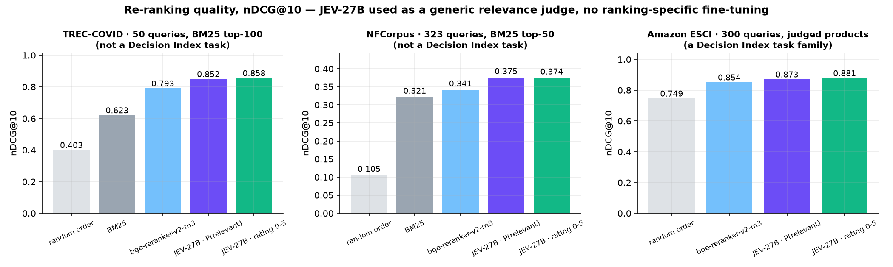

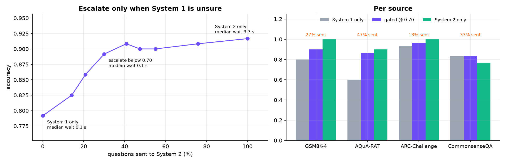

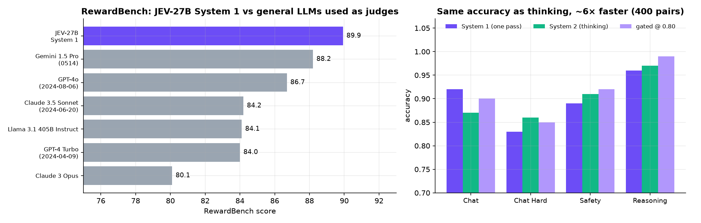

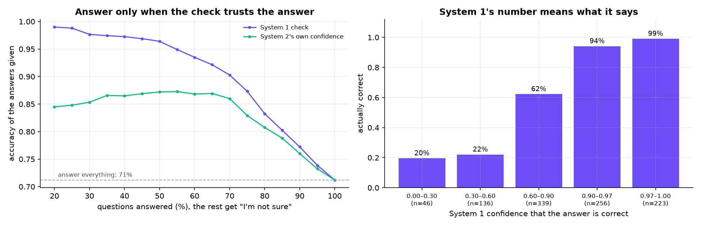

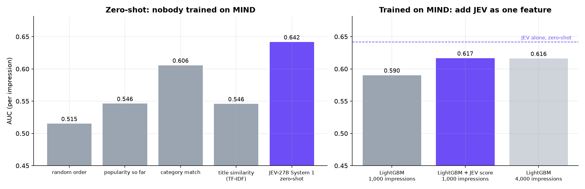

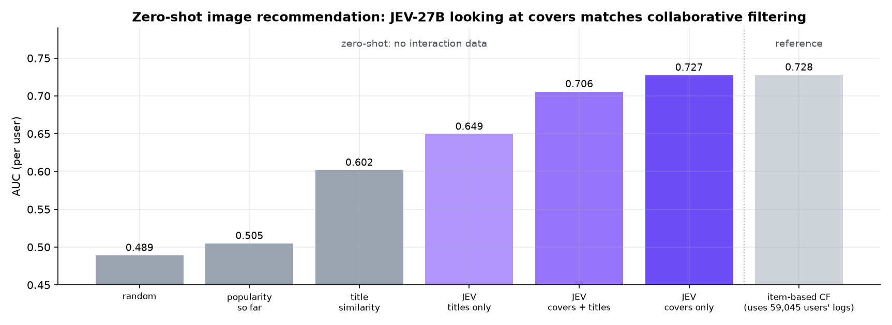

## Quick start

You need one GPU with 80 GB or more (H100 / H200 / B200 / RTX PRO 6000) for the server. The demos themselves run anywhere.

```bash
pip install -r requirements.txt            # demo side
pip install vllm                           # server side (Qwen3.5/3.8 support required)

bash common/serve_jev27b.sh                # downloads autotrust/JEV-27B (~54 GB) and starts vLLM on :8000
python 01-search-ranking/demo.py           # any demo
python app/app.py                          # web app on http://localhost:7860
```

Set `JEV_URL` if the server is not on `localhost:8000`.

**Image input** (demo 07): [**autotrust/JEV-27B-VL**](https://huggingface.co/autotrust/JEV-27B-VL) is JEV-27B with vision.
`bash common/serve_jev27b_mm.sh` serves it, so both systems also accept images. It runs every other demo too.

**Using a hosted JEV API instead of your own GPU:** set the URL and key, then run any demo or the app unchanged.

```bash
export JEV_URL="https://jev-h200.scienceguru.ai/v1"
export JEV_API_KEY="<your API key>"      # System 1 then uses POST /v1/decide; all requests send the Bearer key
```

Setting `JEV_API_KEY` selects the hosted backend automatically; `JEV_BACKEND=vllm|decide` overrides it. Details (Chinese):
[HIGHLIGHTS_zh.md → 切换 API 服务](HIGHLIGHTS_zh.md#切换-api-服务).

## The whole API

```python
from jev_client import decide, decide_many, chat, split_thinking      # common/jev_client.py, ~80 lines

decide("choice", state, "Which team should handle this ticket?", ["billing", "mobile app", "platform / SSO"])
# e.g. {'billing': 0.998, 'mobile app': 0.001, 'platform / SSO': 0.001}
decide("noul", state, "Is this scenario one where: a human must respond personally?")    # -> {'false': .., 'true': ..}
decide("score", state, "Rate how urgent this ticket is on a 0-5 scale.")                 # -> {'0': .., ..., '5': ..}
decide_many([(kind, state, question, options), ...])      # concurrent; vLLM batches them on the GPU
decide_mm("noul", ["Covers the user watched:", {"image": "a.jpg"}, "Candidate:", {"image": "b.jpg"}],
          "Is this scenario one where: this user clicks on the candidate video?")        # images (multimodal server)

reasoning, answer = split_thinking(chat(prompt, thinking=True))                          # System 2
```

`state` is any text or JSON. System 1 is a LoRA adapter plus a decision head expressed as an `lm_head` LoRA, served by vLLM
as the model `jev-decision`. `jev_client.decide` asks for the logprobs of the verbalizer tokens only and applies the bundled
bias and per-kind temperature, so no text is ever generated or parsed.

## Screenshots

| | |
|---|---|
| 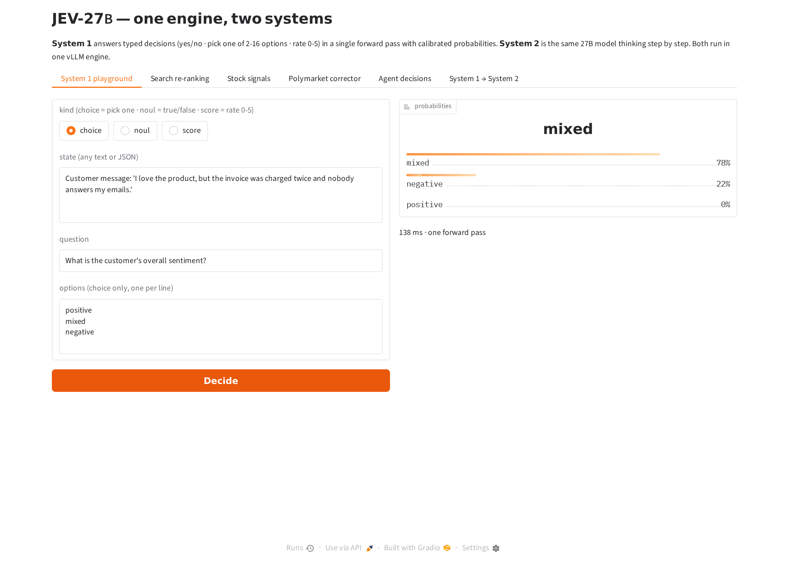 | 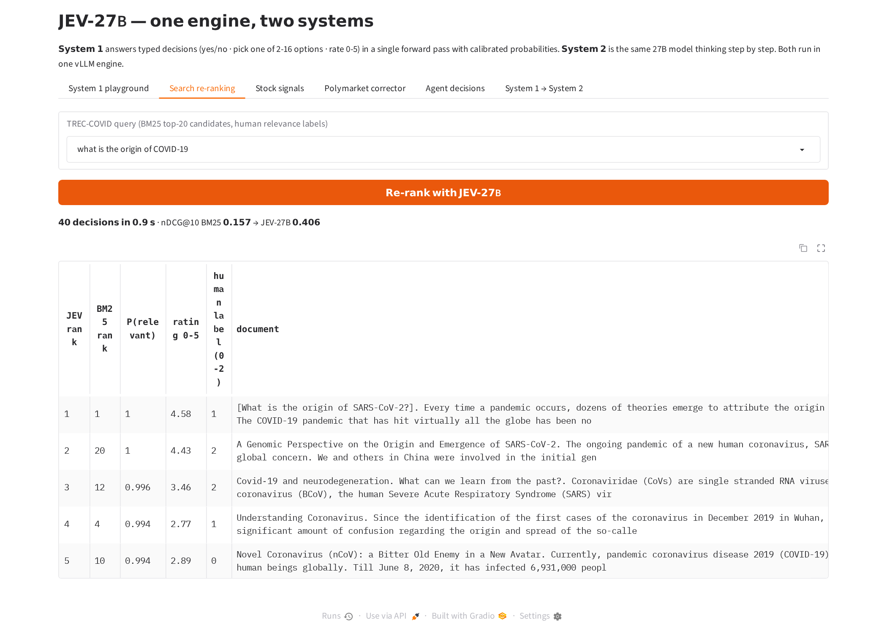 |
| 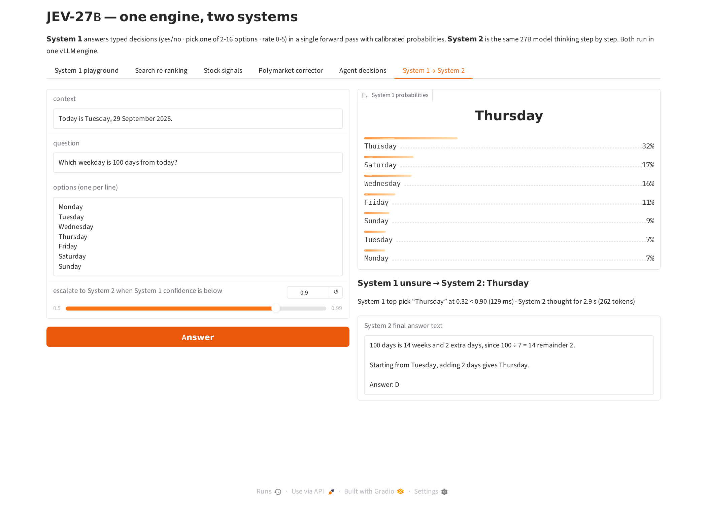 | 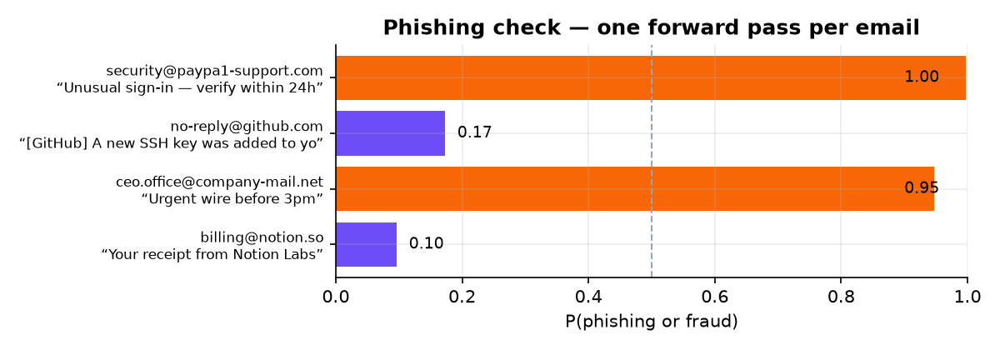 |
| 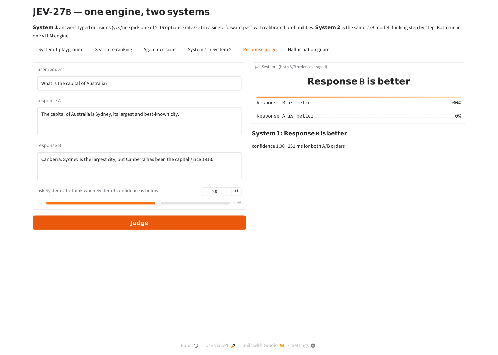 | 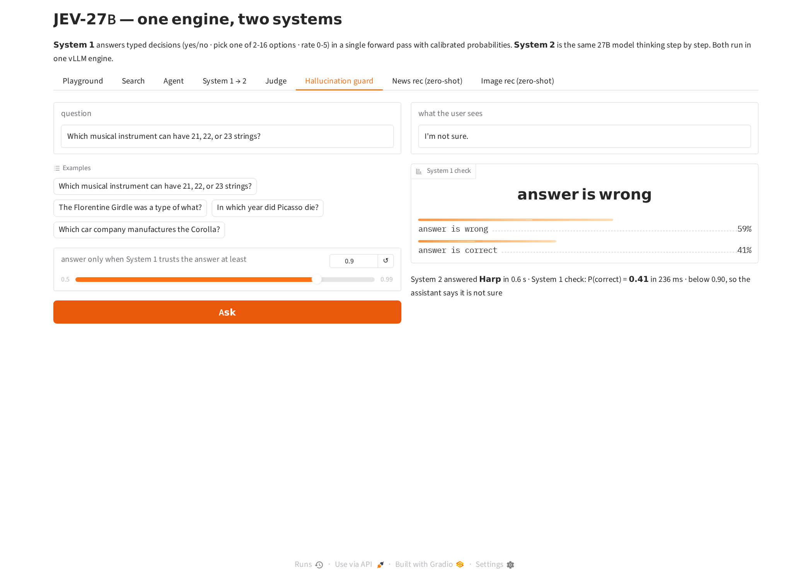 |
| 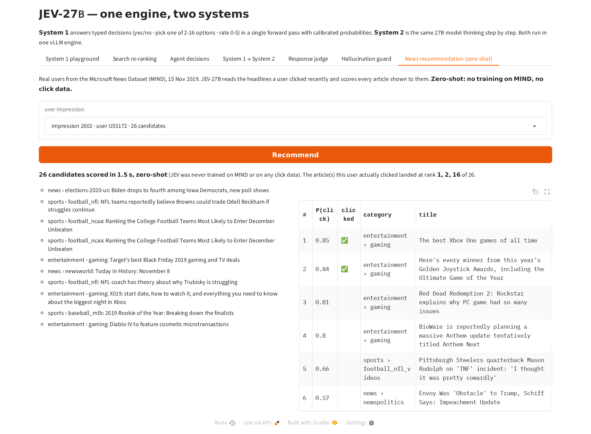 | 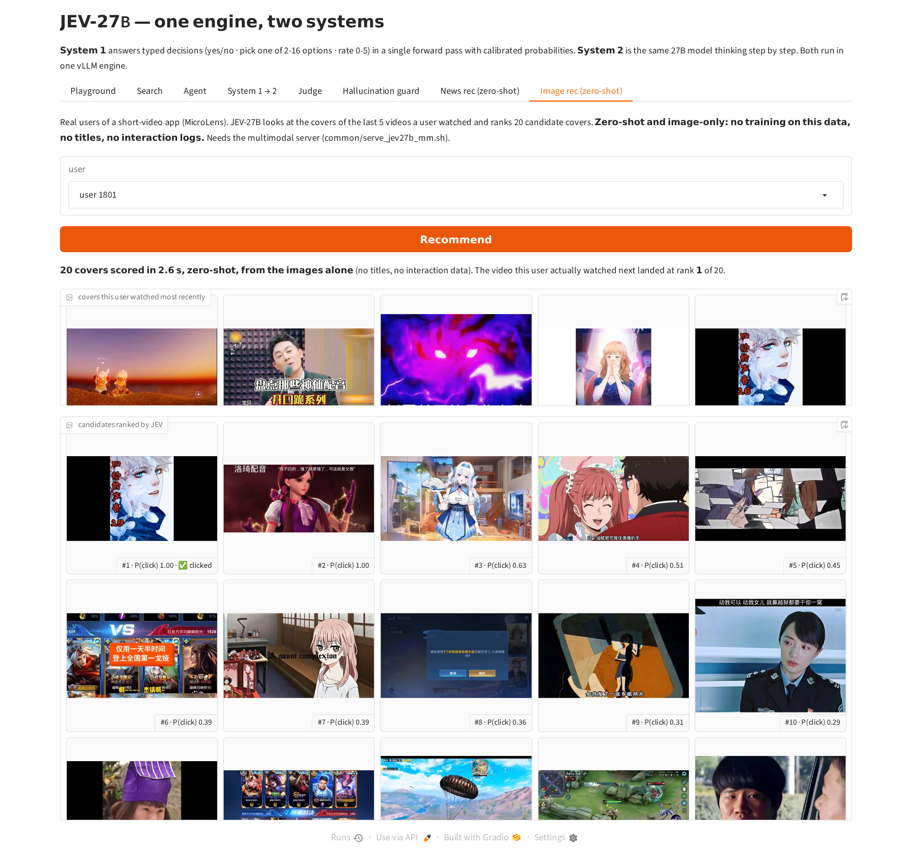 |

## Licence

Code: Apache-2.0. Model: see [autotrust/JEV-27B](https://huggingface.co/autotrust/JEV-27B). Data: TREC-COVID / NFCorpus via BEIR,
GSM8K (MIT), AQuA-RAT (Apache-2.0), ARC (CC BY-SA 4.0), CommonsenseQA (MIT), RewardBench (ODC-BY), TriviaQA (Apache-2.0), MIND (Microsoft Research License Terms) and MicroLens (Westlake University, research use), both downloaded at run time and not redistributed.
